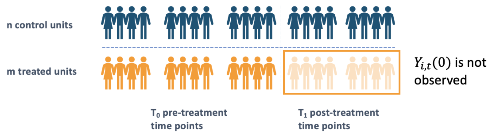

# Panel Data  -- Paradigm 3

Before we dive into the details of the methodology in this section, we would like to briefly introduce the preliminary and structure of panel data. 

Panel data is a specific type of longitudinal data that measures some quantities of individuals over time, which has a very broad application in real life. For example, the length of trees in a specific area, the annual GDP across different countries, stock prices of various firms can all be measured chronologically, thus arising different types of causal effect estimation problems in the context of causal inference.

Suppose there are $N=m+n$ units (or individuals) in total. The first $n$ units are assigned to control group and the rest $m$ units are assigned to treatment group. In the treated group, the units will get treated after $T_0$, while in the control group all of the units will stay untreated all the time. Our purpose in causal effect learning with panel data is to identify, estimate and infer on the effect of the treatment with the changing of time.

Define $Y_{i,t}$ as the outcome of interest we observe for unit $i$ at time $t$. There are several causal estimands of our interest in panel data analysis:

*   **Individual treatment effect (ITE)**: $\Delta_{i,t} = Y_{i,t}(1)-Y_{i,t}(0)$, which denotes the treatement effect of unit $i$ at time $t$;
*   **Average treatment effect (ATE)**: $\mathbb{E}[\Delta_{i,t}]=\mathbb{E}[Y_{i,t}(1)-Y_{i,t}(0)]$, where the expectation is taken w.r.t. time and units. Note that this estimand is well defined only when the ITEs follow a stationary process over time.
*   **Heterogeneous treatment effect (HTE)**: $\tau(s)= \mathbb{E}[\Delta_{i,t}|S_i=s]=\mathbb{E}[Y_{i,t}(1)-Y_{i,t}(0)]|S_i=s]$.

In the next subsections, we will introduce several representative methods to conduct panel data causal estimation, including Difference-in-Difference (DiD), Synthetic Control (SC), etc.

