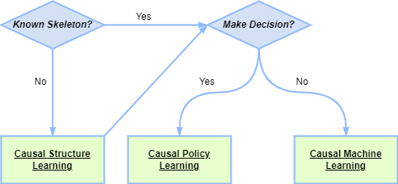
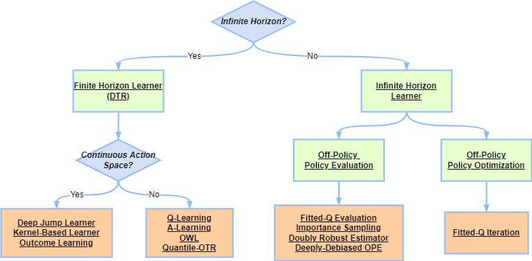
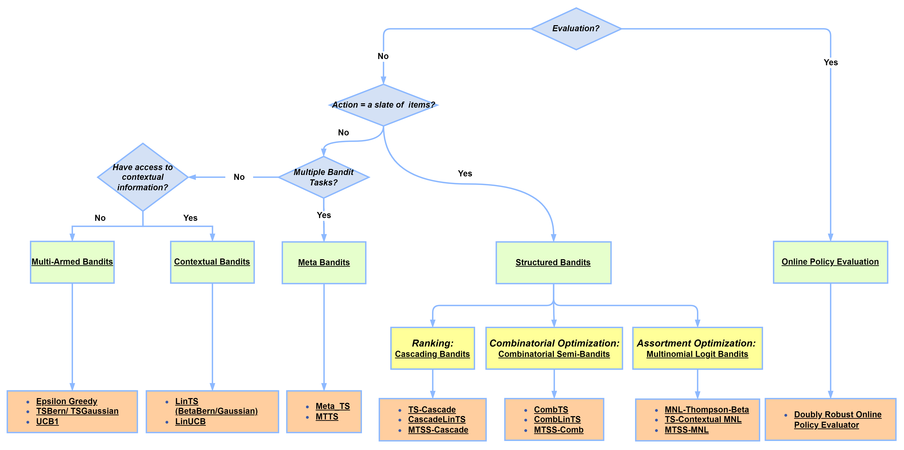

# Map

In this section, we provide a structured map for the zoo of off-policy evaluation and optimization methods. 
The main purpose is to guide practitioners to find appropriate solutions for their problems, and hence to reduces the gap from academic research to real-world applications. 
We focus on several key decision points, including action, reward, features, policy classes, confounders, side information, etc. 

**RZ**: given our target audience, I suggest to set our taxonomy as application-oriented instead of method-oriented. 
Let's 

1. Collect some papers
2. Classify them based on the taxonomy and select according the quality
3. Draw the map
4. Begin to review these methods and implement them

We aim to include the cited papers in this tutorial and also add the corresponding Python implementations to the accompanying package, in an incremental manner. 

<!--
3.1.1 parametric: Q-learning, etc.
3.1.2 semiparametric: A, single index, etc.
3.1.3 nonparametric: OWL, tree based, etc. (including review of ML)
-->

## Off-Policy Evaluation

## Off-Policy Optimization

## Statistical Inference

💥The following are examples only
## Supported Offline Algorithms

| Algorithm | Treatment Type | Outcome Type | Single Stage? | Multiple Stages? | Infinite Horizon? | Evaluation? | Optimization? | C.I.? | Advantages |
|:-|:-:|:-:|:-:|:-:|:-:|:-:|:-:|:-:|:-:|
| [Q-Learning](https://www.jmlr.org/papers/volume6/murphy05a/murphy05a.pdf) | Discrete | Continuous (Mean) |✅|✅| |✅|✅| ||
| [A-Learning](https://www.researchgate.net/profile/Eric-Laber/publication/221665211_Q-_and_A-Learning_Methods_for_Estimating_Optimal_Dynamic_Treatment_Regimes/links/58825d074585150dde402268/Q-and-A-Learning-Methods-for-Estimating-Optimal-Dynamic-Treatment-Regimes.pdf) | Discrete | Continuous (Mean) |✅|✅|  |✅|✅| ||
| [OWL](https://www.tandfonline.com/doi/pdf/10.1080/01621459.2012.695674?casa_token=bwkVvffpyFcAAAAA:hlN58Fbz59blLj5npZFjEQD-HkPeMevEN5pWWLu_vuIVxPWl5aYShgCVHUVeODAfj6Pr8DpzGFlPZ1E) | Discrete | Continuous (Mean) |✅|❗BOWL| |✅|❗TODO| ||
| [Quatile-OTR](https://doi.org/10.1080/01621459.2017.1330204) | Discrete | Continuous (Quantiles) |✅✏️|  |  |✅✏️|✅✏️| ||
| [Deep Jump Learner](https://proceedings.neurips.cc/paper/2021/file/816b112c6105b3ebd537828a39af4818-Paper.pdf) | Continuous | Continuous/Discrete |✅|  |  |✅| ✅| | Flexible to implement & Fast to Converge|
|**TODO** | | ||  |  ||| ||
| Policy Search| | ||  |  ||| ||
| Concordance-assisted learning| | ||  |  ||| ||
| Entropy learning | | ||  |  ||| ||
| **Continuous Action Space (Main Page)** | | ||  |  ||| ||
| Kernel-Based Learner | | ||  |  ||| ||
| Outcome Learning | | ||  |  ||| ||
| **Miscellaneous (Main Page)** | | ||  |  ||| ||
| Time-to-Event Data | | ||  |  ||| ||
| Adaptively Collected Data | | ||  |  ||| ||

## Supported Online Algorithms

| algorithm | Reward | with features? | Advantage | Progress|
|:-|:-:|:-:|:-:|:-:|
| **Single-Item Recommendation** || | |95% (proofreading)|
| [$\epsilon$-greedy]() | Binary/Gaussian | |Simple| 100%|
| [TS](https://www.ccs.neu.edu/home/vip/teach/DMcourse/5_topicmodel_summ/notes_slides/sampling/TS_Tutorial.pdf) | Binary/Guaasian | | |100%|
| [LinTS](http://proceedings.mlr.press/v28/agrawal13.pdf) | Gaussian | ✅ | | 90% notebook|
| [GLMTS](http://proceedings.mlr.press/v108/kveton20a/kveton20a.pdf) | GLM | ✅ | | 0% |
| [UCB1](https://link.springer.com/content/pdf/10.1023/A:1013689704352.pdf) | Binary/Gaussian | | |  100%|
| [LinUCB](https://dl.acm.org/doi/pdf/10.1145/1772690.1772758?casa_token=CJjeIziLmjEAAAAA:CkRvgHQNqpy10rzcUP5kx31NWJmgSldd6zx8wZxskZYCoCc8v7EDIw3t3Gk1_6mfurqQTqRZ7fVA) | Guassian | ✅ | | 50% (code ready)|
| [UCB-GLM](http://proceedings.mlr.press/v70/li17c/li17c.pdf) | GLM | ✅ | | 0%|
|*Multi-Task*|| | |0% (main page)|
|Meta-TS|| | |50% (code almost ready)|
|MTSS|| | |50% (code almost ready)|
| **Slate Recommendation** || | |95% (proofreading)|
| *Online Learning to Rank* || | |95% (proofreading)|
| [TS-Cascade](http://proceedings.mlr.press/v89/cheung19a/cheung19a.pdf) | Binary | | | 40% code+notebook|
| [CascadeLinTS](https://arxiv.org/pdf/1603.05359.pdf) | Binary | ✅ | |  40% code+notebook|
| [MTSS-Cascade](https://arxiv.org/pdf/2202.13227.pdf) | Binary | ✅ | Scalable, Robust, accounts for inter-item heterogeneity | 95% (proofreading)|
| *Online Combinatorial Optimization* || | |95% (proofreading)|
| [CombTS](http://proceedings.mlr.press/v80/wang18a/wang18a.pdf) | | | | 50% code ready|
| [CombLinTS](http://proceedings.mlr.press/v37/wen15.pdf) | | ✅ | | 50% code ready
| [MTSS-Comb](https://arxiv.org/pdf/2202.13227.pdf) | Continuous | ✅ | Scalable, Robust, accounts for inter-item heterogeneity | 95% (proofreading)|
| *Dynamic Assortment Optimization* || | |95% (proofreading)|
| [MNL-Thompson-Beta](http://proceedings.mlr.press/v65/agrawal17a/agrawal17a.pdf) | Binary | | |  40% code+notebook|
| [TS-Contextual-MNL](https://proceedings.neurips.cc/paper/2019/file/36d7534290610d9b7e9abed244dd2f28-Paper.pdf) | Binary | ✅ | |  40% code+notebook|
| [MTSS-MNL](https://arxiv.org/pdf/2202.13227.pdf) | Binary | ✅ | Scalable, Robust, accounts for inter-item heterogeneity |95% (proofreading)|
| [UCB-MNL [6]](https://pubsonline.informs.org/doi/pdf/10.1287/opre.2018.1832?casa_token=6aWDZ292SSsAAAAA:KAG0_j813jxeL6PVNI1dcdLv_CHD7oQ6SKinqxcoq0pC2mX5Q2qGgyYvE8esMSXZPlqOanCPOQ) | Binary | | |80% (notebook)| 
| [LUMB [7]](https://arxiv.org/pdf/1805.02971.pdf) | Binary | ✅ | | 50% code ready|
| **TODO** || | ||
| environment with real data || | |50% MAB is ready|
| overall simulation || | ||

# Other Chapters
| Chapter | Progress|
|:-|:-:|
|**Introduction**| 0%|
|*Motivating Example*|100%|
|*Preliminary*||
|Causal Inference|100%|
|HTE|0%|
|Cusal Discovery|100%|
|Policy Evaluation and Optimization|0%|
|*Map*|keep updating|
|**ONLINE POLICY EVALUATION**| 0%|
|**CAUSAL DISCOVERY LEARNING**| 0%|

 
